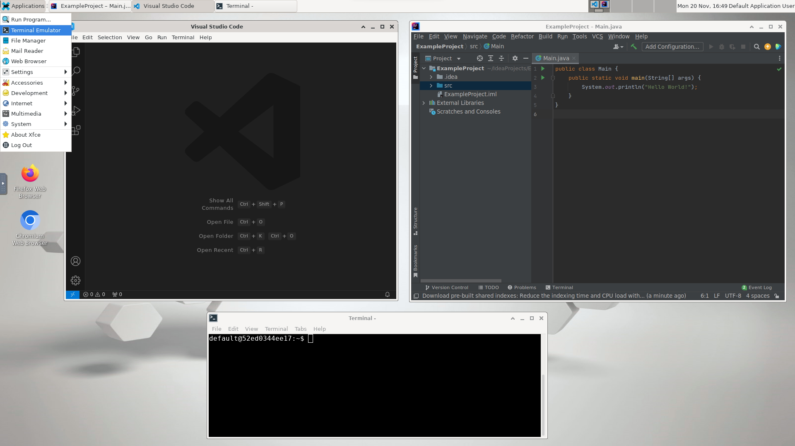

# Remote Debian
Provides a lightweight and functional **Debian** environment with **Xfce**. Enables graphical access to the server from a **web browser**. Useful for remote development and interaction with applications that require a graphical interface.  
Extends [ConSol/docker-headless-vnc-container](https://github.com/ConSol/docker-headless-vnc-container) docker image.

Compatible with Raspberry PI (ARM).

## Included software:  

- IDEs
    - Visual Studio Code (launch with `code /path/to/open`)
    - IntelliJ IDEA Community 2023.2.5 (launch with `idea`)

- General Tools:
    - Git
    - Python 3
    - OpenJDK 11
    - GCC and Make
    - Node.js and npm

- Specific Tools:
    - Gradle
    - Virtualenv for Python
    - Node Version Manager (NVM) and Node.js

The Docker Image could be extended by modifying `Dockerfile`. Since version `1.1.0` all images run as non-root user per default, so if you want to extend the image and install software, you have to switch back to the root user: 

```Dockerfile
## Change to root user
USER 0

## Install the needed software
RUN apt install gedit

## Switch back to default user
USER 1000
```

## Persistent Directories

The following volumes are defined in `docker-compose.yml`

- `/headless/Desktop` -> Xfce desktop folder, for shortcuts and icons
- `/headless/user_data` -> for persistent user data.

More volumes and paths can be configured in `docker-compose.yml` and `.env` files

## Connect & Control

* connect via __noVNC HTML5 full client__: [`http://localhost:6901/vnc.html`](http://localhost:6901/vnc.html), default password: `vncpassword`
* connect via __noVNC HTML5 lite client__: [`http://localhost:6901/?password=vncpassword`](http://localhost:6901/?password=vncpassword)

## Specific Configuration

Available ENV variables (`.env` file):

* `VNC_COL_DEPTH`, default: `24` (Color Depth)
* `VNC_RESOLUTION`, default: `1920x1080` (Viewer Resolution)
* `VNC_PW`, default: `vncpassword` (VNC Authentication Password)

Environment variables can be modified in `.env` file (remote_debian service)

## Running it

To run the application, all you need to do is:

```bash
$ docker-compose up --build
```

## Screenshots

